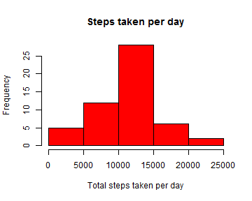
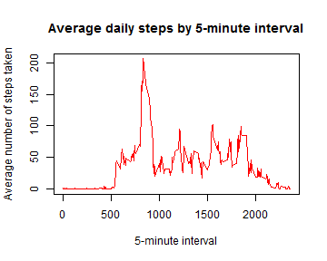
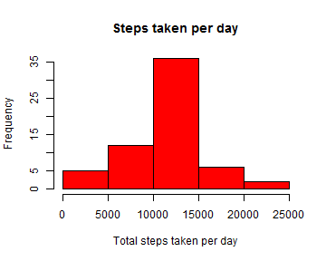
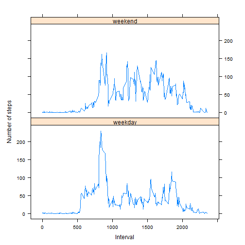

## Downloading and extracting the data

**Download the data file (if missing) and extract the contents (if missing).**


```r
url <- "http://d396qusza40orc.cloudfront.net/repdata%2Fdata%2Factivity.zip"
zipfile <- "activity.zip"
rawfile <- "activity.csv"
if (! file.exists(zipfile)) { 
    download.file(url, zipfile , "curl") 
}
if (! file.exists(rawfile)) { 
    unzip(zipfile, rawfile) 
}
```


## Loading and preprocessing the data

**Load the data into a data frame.**


```r
activity <- read.csv("activity.csv", header = TRUE, stringsAsFactors = FALSE, 
                     colClasses = c("numeric", "Date", "numeric"))
```

## What is mean total number of steps taken per day?

**Aggregate the data by calculating the daily average for each time interval.**


```r
# Aggregate sum of steps by date 
activity.sum.by.date <- aggregate(formula = steps ~ date, 
                                  data = activity,
                                  FUN = sum,
                                  na.rm = TRUE)
```

**Produce a histogram of the average number of steps taken per day.**


```r
# Plot histogram of steps taken per day
hist(activity.sum.by.date$steps, 
     main = "Steps taken per day", 
     xlab = "Total steps taken per day", 
     col = 2)
```

 

**Find the mean number of steps taken per day.**


```r
# Set some default options for the display of numbers
options(scipen = 1, digits = 1)

# Calculate mean of steps per day
mean.steps.per.day <- mean(activity.sum.by.date$steps)
mean.steps.per.day
```

```
## [1] 10766
```

**Find the median number of steps taken per day.**


```r
# Calculate median of steps per day
median.steps.per.day <- median(activity.sum.by.date$steps)
median.steps.per.day
```

```
## [1] 10765
```

## What is the average daily activity pattern?

**Aggregate the data set to calculate the average steps per time interval.**


```r
# Aggregate mean of steps by time interval, over all dates
activity.mean.by.interval <- aggregate(formula = steps ~ interval, 
                                  data = activity,
                                  FUN = mean,
                                  na.rm = TRUE)
```

**Plot a time series of 5-minute intervals and average steps taken.**


```r
# Plot a time series of 5-minute intervals (x) and mean steps taken (y)
# averaged across all days. Use the base R plotting system with type = "1".
plot(steps ~ interval, data = activity.mean.by.interval, type = "l", 
     xlab = "5-minute interval", 
     ylab = "Average number of steps taken", 
     main = "Average daily steps by 5-minute interval", 
     col = "2")
```

 

**Find the interval with the most steps, on average.**


```r
# Find the interval containing the max number of steps, 
steps.max <- max(activity.mean.by.interval$steps)
library(dplyr)
steps.max.interval <- filter(activity.mean.by.interval, steps == steps.max)
steps.max.interval.number <- steps.max.interval$interval
steps.max.interval.number
```

```
## [1] 835
```

## Imputing missing values

**Find the number of rows with missing values.**


```r
# Find the total number of missing values (number of rows with NA values)
na.row.count <- sum(is.na(activity))
na.row.count
```

```
## [1] 2304
```

**Fill in the missing values with the interval average.**


```r
# Create a dataset like the original, but with missing data filled in with the
# mean for that interval.
activity.na.is.mean <- activity %>% 
    mutate(steps= replace(steps, is.na(steps), activity.mean.by.interval$steps))
```

**Produce a histogram of steps taken per day, using the data set prepared above.**


```r
# Aggregate sum of steps by date 
activity.sum.by.date.na.is.mean <- aggregate(formula = steps ~ date,
                                             data = activity.na.is.mean,
                                             FUN = sum,
                                             na.rm = TRUE)

# Plot histogram of steps taken per day
hist(activity.sum.by.date.na.is.mean$steps, 
     main = "Steps taken per day", 
     xlab = "Total steps taken per day", 
     col = 2)
```

 

**Find the mean steps per day.**


```r
# Calculate mean of steps per day
mean.steps.per.day.na.is.mean <- mean(activity.sum.by.date.na.is.mean$steps)
mean.steps.per.day.na.is.mean
```

```
## [1] 10766
```

**Compare against the mean produced earlier (ignoring the missing values).**


```r
mean.steps.per.day
```

```
## [1] 10766
```

The mean is essentially the same as the mean using imputed values.

**Find the median steps per day.**


```r
# Calculate median of steps per day
median.steps.per.day.na.is.mean <- median(activity.sum.by.date.na.is.mean$steps)
median.steps.per.day.na.is.mean
```

```
## [1] 10766
```

**Compare against the median produced earlier (ignoring the missing values).**


```r
median.steps.per.day
```

```
## [1] 10765
```

The median is essentially the same as the median using imputed values.

**Estimate the total daily number of steps taken.**


```r
# Calculate sum of steps per day
sum.steps.per.day.na.is.mean <- sum(activity.sum.by.date.na.is.mean$steps)
sum.steps.per.day.na.is.mean
```

```
## [1] 656738
```

**Compare against the sum of steps taken ignoring missing values.**


```r
# Calculate sum of steps per day
sum.steps.per.day <- sum(activity.sum.by.date$steps)
sum.steps.per.day
```

```
## [1] 570608
```

**Find the percentage difference between the esimated number of steps and the 
number actually recorded.**


```r
# Calculate number of steps due to imputing values from the interval means.
imputed.steps <- sum.steps.per.day.na.is.mean - sum.steps.per.day
sum.steps.percent.increase.due.to.imputation <- 
    ( imputed.steps / sum.steps.per.day ) * 100
```

There were 86129.5 more steps estimated than were actually recorded.
This is an increase of 15.1 percent 
over the recorded number of steps. This was the impact of imputing values 
versus ignoring them.

## Are there differences in activity patterns between weekdays and weekends?

**Compare activity patterns between weekdays and weekends.**


```r
library(chron)
activity.imputed.day.type <- mutate(activity.na.is.mean, 
                                   day.type = ifelse(is.weekend(date), 
                                                     "weekend", "weekday"))
activity.imputed.day.type$day.type <- factor(activity.imputed.day.type$day.type)

activity.mean.by.interval.imputed.day.type <- aggregate(
    formula = steps ~ interval + day.type, 
    data = activity.imputed.day.type,
    FUN = mean,
    na.rm = TRUE)

# Create a two-panel plot to show the difference in time series between 
# weekends and weekdays.
library(lattice)

xyplot(steps ~ interval | day.type, 
       data = activity.mean.by.interval.imputed.day.type, aspect = 1/2, 
       type = "l", xlab="Interval", ylab="Number of steps")
```

 

The plot shows that the weekends generally have more steps in the intervals 
higher than about 1000, while the weekdays have more steps in the intervals 
below 1000.
